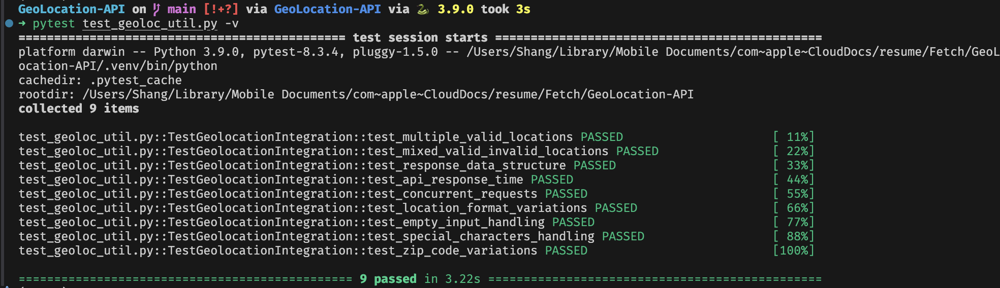

# Geo-Location Lookup CLI

A command line tool that gets location info using OpenWeather API.

I didn't want to attach the take home test pdf in a public repo. 

## Quick Setup
This what I've done for venv, I didn't commit the .venv folder
```bash
python -m venv .venv
source .venv/bin/activate  
pip install requests python-dotenv pytest
```

Add the key into `.env`:
```
OPENWEATHER_API_KEY= ***
```

## Usage

geoloc_util.py is the API call.

test_geoloc_util.py is the test file. 

According to the test file: `
```bash
# Look up single location
python geoloc_util.py "Chicago, IL"

# Multiple locations
python geoloc_util.py “Madison, WI” “12345” “Chicago, IL” “10001”
```

## Test
```bash
pytest test_geoloc_util.py -v
```

## Input Formats
- City, State: "Madison, WI"
- ZIP code: "12345"

Note: US locations only


# I've done below tests 

Test Coverage

These are the Integration tests that I can think of to verify the full system functionality using the API key:

API integration: 

1. Multiple location processing
2. Valid/invalid location handling
3. Response data structure validation
4. API response time
5. Multiple concurrent requests

Input processing:

6. Input format variations (spaces, case sensitivity)
7. Empty inputs
8. Special characters inputs
9. Error handling (invalid cities/ZIP codes)


